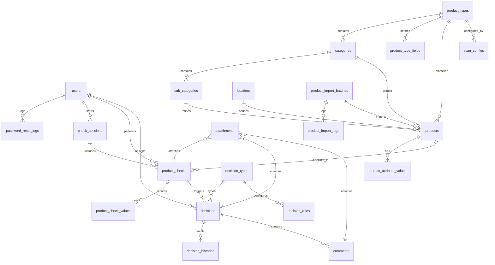

# Stock Verification and Inspection System

This document outlines the detailed system architecture, database design, directory structure, service layers, and step-by-step implementation plan for the dynamic, metadata-driven Stock Verification and Inspection System.

---

## Technical Stack
- **Framework**: Laravel 13 & PHP 8.3
- **Frontend / Dynamic Views**: Livewire 3 & Alpine.js
- **Styling**: TailwindCSS & Custom Modern Glassmorphic Styles
- **Administration & CRUD Configuration**: Filament v4 (Panels & Forms)
- **Database**: MySQL 8.0+
- **Camera Scanning**: `html5-qrcode` library for QR/Barcode reading

---

## User Review Required

> [!IMPORTANT]
> **Database Structure**: All product types share a single `products` table and a dynamic `product_attribute_values` EAV table to allow runtime dynamic product fields.
> **Import Engine**: Dynamic CSV import supports flexible columns mapping to dynamic field names. We've added `import_batch_id` on the `products` table to allow clean rollback.
> **Validation Engine**: Configured rules and tolerances are stored as JSON in `scan_configs`. Mismatches trigger event-driven automatic decision assignments using Spatie Permissions and the `decision_rules` table.

---

## Open Questions

> [!NOTE]
> None at the moment. We are ready to proceed once this plan is approved.

---

## Proposed Database Schema & ERD

We will create the migrations for the following database tables:



### Table Details

#### 1. `users` (Modified)
- `id` (bigint, PK)
- `name` (varchar)
- `email` (varchar, unique)
- `password` (varchar)
- `status` (varchar, default `'ACTIVE'`) -> `ACTIVE`, `SUSPENDED`
- `last_login_at` (timestamp, nullable)
- `email_verified_at` (timestamp, nullable)
- `remember_token` (varchar, nullable)
- `created_at` (timestamp)
- `updated_at` (timestamp)

#### 2. `password_reset_logs`
- `id` (bigint, PK)
- `user_id` (bigint, FK users)
- `ip_address` (varchar, nullable)
- `user_agent` (varchar, nullable)
- `created_at` (timestamp)

#### 3. `product_types`
- `id` (bigint, PK)
- `name` (varchar) -> e.g., 'Jewelry', 'Food'
- `code` (varchar, unique) -> e.g., 'JEWELRY', 'FOOD'
- `is_active` (boolean, default true)
- `created_at` / `updated_at`

#### 4. `categories`
- `id` (bigint, PK)
- `product_type_id` (bigint, FK product_types)
- `name` (varchar)
- `created_at` / `updated_at`

#### 5. `sub_categories`
- `id` (bigint, PK)
- `category_id` (bigint, FK categories)
- `name` (varchar)
- `created_at` / `updated_at`

#### 6. `locations`
- `id` (bigint, PK)
- `code` (varchar, unique) -> e.g., 'WH-A1-S3'
- `name` (varchar)
- `description` (text, nullable)
- `created_at` / `updated_at`

#### 7. `product_type_fields`
- `id` (bigint, PK)
- `product_type_id` (bigint, FK product_types)
- `field_name` (varchar) -> e.g., 'weight_g', 'expiry_date'
- `field_label` (varchar) -> e.g., 'Weight (grams)', 'Expiry Date'
- `field_type` (varchar) -> `text`, `number`, `decimal`, `date`, `textarea`, `select`, `boolean`
- `required` (boolean, default false)
- `is_active` (boolean, default true)
- `created_at` / `updated_at`

#### 8. `products`
- `id` (bigint, PK)
- `product_type_id` (bigint, FK product_types)
- `location_id` (bigint, FK locations, nullable)
- `category_id` (bigint, FK categories)
- `sub_category_id` (bigint, FK sub_categories, nullable)
- `code` (varchar, unique)
- `barcode` (varchar, nullable, index)
- `qr_code` (varchar, nullable, index)
- `name` (varchar)
- `description` (text, nullable)
- `status` (varchar, default `'ACTIVE'`)
- `import_batch_id` (bigint, FK product_import_batches, nullable, cascade delete/nullify)
- `created_at` / `updated_at`

#### 9. `product_attribute_values`
- `id` (bigint, PK)
- `product_id` (bigint, FK products, cascade delete)
- `field_name` (varchar, index)
- `value` (text, nullable)
- `created_at` / `updated_at`
- *Unique Constraint*: `(product_id, field_name)`

#### 10. `product_import_batches`
- `id` (bigint, PK)
- `file_path` (varchar)
- `file_name` (varchar)
- `product_type_id` (bigint, FK product_types)
- `status` (varchar) -> `PENDING`, `SUCCESS`, `FAILED`, `ROLLBACKED`
- `total_rows` (integer)
- `imported_rows` (integer)
- `failed_rows` (integer)
- `created_by` (bigint, FK users)
- `created_at` / `updated_at`

#### 11. `product_import_logs`
- `id` (bigint, PK)
- `batch_id` (bigint, FK product_import_batches, cascade delete)
- `row_number` (integer)
- `data_json` (json)
- `errors_json` (json, nullable)
- `status` (varchar) -> `SUCCESS`, `FAILED`
- `created_at`

#### 12. `scan_configs`
- `id` (bigint, PK)
- `product_type_id` (bigint, FK product_types)
- `name` (varchar)
- `description` (text, nullable)
- `config_json` (json)
- `is_active` (boolean, default true)
- `created_at` / `updated_at`

#### 13. `check_sessions`
- `id` (bigint, PK)
- `name` (varchar)
- `description` (text, nullable)
- `started_by` (bigint, FK users)
- `started_at` (timestamp)
- `completed_at` (timestamp, nullable)
- `status` (varchar) -> `DRAFT`, `OPEN`, `COMPLETED`, `CANCELLED`
- `created_at` / `updated_at`

#### 14. `product_checks`
- `id` (bigint, PK)
- `check_session_id` (bigint, FK check_sessions)
- `product_id` (bigint, FK products)
- `checked_by` (bigint, FK users)
- `checked_at` (timestamp)
- `result_status` (varchar) -> `PASS`, `FAIL`, `WARNING`
- `remark` (text, nullable)
- `created_at` / `updated_at`

#### 15. `product_check_values`
- `id` (bigint, PK)
- `product_check_id` (bigint, FK product_checks, cascade delete)
- `field_name` (varchar)
- `expected_value` (text, nullable)
- `actual_value` (text, nullable)
- `difference_value` (text, nullable)
- `created_at` / `updated_at`

#### 16. `decision_types`
- `id` (bigint, PK)
- `name` (varchar) -> e.g., 'Investigate', 'Recount'
- `code` (varchar, unique) -> e.g., 'INVESTIGATE', 'RECOUNT'
- `description` (text, nullable)
- `is_active` (boolean, default true)
- `created_at` / `updated_at`

#### 17. `decisions`
- `id` (bigint, PK)
- `product_check_id` (bigint, FK product_checks)
- `decision_type_id` (bigint, FK decision_types)
- `action_status` (varchar) -> `OPEN`, `IN_PROGRESS`, `DONE`, `REJECTED`
- `assigned_to` (bigint, FK users, nullable)
- `decision_by` (bigint, FK users)
- `remark` (text, nullable)
- `created_at` / `updated_at`

#### 18. `decision_rules`
- `id` (bigint, PK)
- `name` (varchar) -> e.g., 'Weight mismatch trigger'
- `criteria_field` (varchar) -> e.g., 'weight_g', 'location_id', etc.
- `criteria_condition` (varchar) -> `mismatch`, `exceeds_tolerance`
- `decision_type_id` (bigint, FK decision_types)
- `is_active` (boolean, default true)
- `created_at` / `updated_at`

#### 19. `decision_histories`
- `id` (bigint, PK)
- `decision_id` (bigint, FK decisions, cascade delete)
- `old_status` (varchar)
- `new_status` (varchar)
- `changed_by` (bigint, FK users)
- `remark` (text, nullable)
- `created_at` / `updated_at`

#### 20. `comments`
- `id` (bigint, PK)
- `decision_id` (bigint, FK decisions, cascade delete)
- `user_id` (bigint, FK users)
- `comment_type` (varchar) -> `DECISION` (discussion), `LOG` (audit notes)
- `comment` (text)
- `created_at` / `updated_at`

#### 21. `attachments`
- `id` (bigint, PK)
- `attachable_type` (varchar) -> Morph relation (ProductCheck, Decision, Comment)
- `attachable_id` (bigint) -> Morph ID
- `file_path` (varchar)
- `file_name` (varchar)
- `file_type` (varchar)
- `file_size` (integer)
- `uploaded_by` (bigint, FK users)
- `created_at` / `updated_at`

---

## Service Layer & Architecture Design

### 1. `ProductImportService`
Handles bulk uploads of products from CSV or Excel files.
- Validates the structure and data of the file against the targeted `ProductType` dynamic fields.
- Logs success and error details into `product_import_logs` dynamically.
- Implements `rollbackBatch($batchId)` which safely deletes all products and attribute values associated with that batch if an error triggers rollback.

### 2. `ValidationEngine`
A dynamic service that compares the expected values from the product record (and attributes) against the scanned actual values.
- Reads `scan_configs.config_json` to know which fields to validate.
- Compares expected vs actual values:
  - If `compare` is true, performs checks:
    - String comparison: exact match.
    - Numeric/decimal comparison: respects `tolerance` threshold.
  - If difference exceeds tolerance, marks field as mismatched and calculates the difference value.
- Produces a summary result status: `PASS`, `FAIL`, or `WARNING`.

### 3. `DecisionWorkflowService`
Runs after check completion.
- Scans `decision_rules` table.
- If a rule criteria field (e.g. `weight_g` mismatch) aligns with the failed validations in the check session, it automatically creates a corresponding decision of `decision_type_id` marked as `OPEN`.
- Creates an entry in `decision_histories`.

---

## Custom Mobile Scanner Design (Livewire)

The checker dashboard will render a mobile-optimized scanning workflow:
1. **Selection Page**: Checker selects an active `CheckSession`, the `ProductType` being counted, and the active `ScanConfig`.
2. **Camera scanner interface**:
   - Integrates `html5-qrcode`.
   - Toggle flashlight, select back/front camera.
   - Fits nicely in a card with glassmorphic aesthetic.
3. **Product Verification Page (Side-by-Side UI)**:
   - Once scanned, loads the product details via AJAX/Livewire.
   - Shows a clean comparison grid.
   - Renders appropriate dynamic inputs (dates, decimals, text fields) configured by `ScanConfig`.
   - Allows file uploads (Photos/PDFs) polymorphic-ally saved as attachments.
   - Submitting triggers the validation engine immediately.

---

## Directory Structure

```text
app/
├── Actions/
│   └── CreateDecisionFromRule.php
├── Events/
│   └── ProductChecked.php
├── Filament/
│   ├── Resources/
│   │   ├── CategoryResource.php
│   │   ├── DecisionRuleResource.php
│   │   ├── DecisionTypeResource.php
│   │   ├── LocationResource.php
│   │   ├── ProductResource.php
│   │   ├── ProductTypeResource.php
│   │   ├── ScanConfigResource.php
│   │   └── UserResource.php
│   └── Widgets/
│       ├── AdminStatsWidget.php
│       └── SupervisorPendingDecisionsWidget.php
├── Http/
│   ├── Middleware/
│   │   └── EnsureUserNotSuspended.php
│   └── Livewire/
│       ├── CheckerDashboard.php
│       ├── MobileScanner.php
│       └── SupervisorDashboard.php
├── Listeners/
│   └── RunDecisionEngine.php
├── Models/
│   ├── Attachment.php
│   ├── Category.php
│   ├── CheckSession.php
│   ├── Comment.php
│   ├── Decision.php
│   ├── DecisionHistory.php
│   ├── DecisionRule.php
│   ├── DecisionType.php
│   ├── Location.php
│   ├── PasswordResetLog.php
│   ├── Product.php
│   ├── ProductAttributeValue.php
│   ├── ProductCheck.php
│   ├── ProductCheckValue.php
│   ├── ProductImportBatch.php
│   ├── ProductImportLog.php
│   ├── ProductType.php
│   ├── ProductTypeField.php
│   └── ScanConfig.php
└── Services/
    ├── DecisionWorkflowService.php
    ├── ProductImportService.php
    └── ValidationEngine.php
```

---

## Verification Plan

### Automated Verification
- Write PHPUnit feature tests for:
  - `ProductImportService` parsing CSV, validation, and rollback capability.
  - `ValidationEngine` evaluating tolerances, exact matches, and outputting correct difference values.
  - `DecisionWorkflowService` automatically opening investigations based on rules when checks fail.
  - Livewire Mobile scanner state machine (scanning -> loading product -> form generation).

### Manual Verification
- Seed the DB with standard product types (Jewelry, Food, Phones), custom dynamic fields, and user roles.
- Test camera barcode/QR scanner integration using mock barcode simulator on mobile device.
- Confirm dashboard metrics update dynamically.
